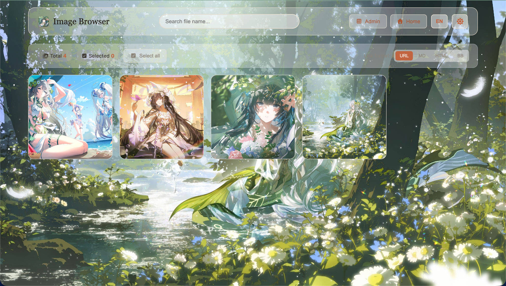
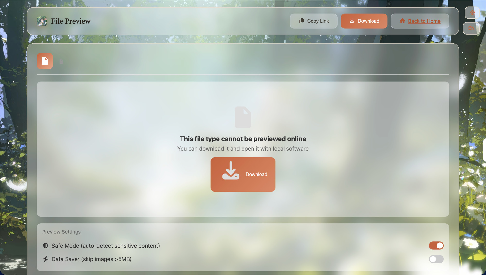
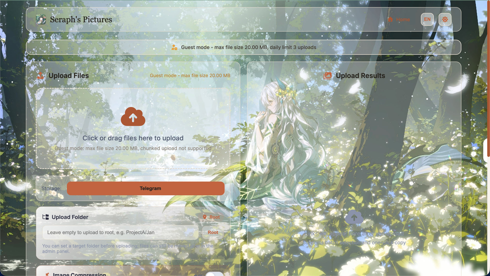

<div align="center">
  

# Seraph's Pictures

A private media workspace for Cloudflare Pages: image/file hosting, admin management, WebDAV upload, and multiple storage backends — with Passkey login, API tokens, and guest uploads.

**English** | [中文](README.md)

[](LICENSE)


</div>

## Table of Contents

- [Overview](#overview)
- [Features](#features)
- [Screenshots](#screenshots)
- [Frontend Map](#frontend-map)
- [Deployment](#deployment)
- [Storage Configuration](#storage-configuration)
- [Guest Uploads](#guest-uploads)
- [Environment Variables](#environment-variables)
- [API Guide](#api-guide)
- [Limitations](#limitations)
- [Verification](#verification)
- [Roadmap](#roadmap)
- [Credits](#credits)
- [License](#license)

## Overview

Seraph's Pictures is a lightweight, private media workspace that deploys to Cloudflare Pages for hosting images, files, audio, video, and documents. The root legacy UI is the stable production surface today, while the Vue app under `/app/` is kept for the newer experience.

- `/` — main upload page
- `/login.html` — login page (password and Passkey)
- `/admin.html` — admin console
- `/gallery.html` — image gallery
- `/webdav.html` — WebDAV upload center
- `/app/status` — Vue status page

The Vue app stays under `/app/`. On Cloudflare Pages the root legacy pages are the reliable main flow; `/app/storage` and `/app/drive` already have UI screens, but their Cloudflare Functions endpoints still need to be completed before they can replace the legacy console (see [Roadmap](#roadmap)).

## Features

> This section lists only **shipped** capabilities; work in progress is in the [Roadmap](#roadmap).

- **Multi-type upload**: images, audio, video, documents, and generic files; chunked upload for large files; upload-from-URL with validation that blocks private/internal targets (SSRF protection).
- **Multiple storage backends**: Telegram, Cloudflare R2, S3-compatible services, Discord, Hugging Face, GitHub, and WebDAV — pick the backend per upload.
- **Passkey / WebAuthn login**: passwordless Passkey login and credential management alongside password login (built on `@simplewebauthn/server`).
- **API tokens and public REST API**: create scoped tokens (upload / read / delete / paste) in the admin console and call `/api/v1/*` with `Authorization: Bearer`, suitable for scripts and tools like ShareX.
- **Share short links**: generate `/s/<slug>` links with optional custom slug, password, expiry, and max-download limits.
- **Guest uploads**: unauthenticated visitors upload to a **separate Telegram bot / channel**, isolated from admin storage; the toggle, retention days, per-IP daily limit, and max file size (≤ 20MB) live in KV and are editable from the admin panel.
- **Admin console**: file listing, folder management (Folder Manager), grid view with pagination, detail view, rename, delete, likes, and move-to-folder.
- **Manual content control**: admins can block/allow individual files; blocked access redirects to `block-img.html`, and in allow-list mode non-listed content redirects to `whitelist-on.html`.
- **WebDAV upload center**: a standalone entry at `/webdav.html`.
- **Gallery with multiple link formats**: browse at `/gallery.html` and copy URL, Markdown, HTML, or BBCode links with one click.
- **Online preview with Data Saver**: in-browser preview for images/media with a data-saver option.
- **Authentication**: Basic Auth plus cookie-based sessions.
- **Branding and theme**: Claude-inspired theme with dark mode and glass-opacity styling.

## Screenshots

<div align="center">

| Main upload page | Gallery (link formats) |
| :---: | :---: |
|  |  |
| **Admin console** | **Passkey login** |
|  |  |
| **Online preview (Data Saver)** | **Guest mode** |
|  |  |

</div>

## Frontend Map

```txt
Root legacy UI
├── index.html          # default upload page
├── login.html          # login (password + Passkey)
├── admin.html          # primary admin console
├── gallery.html        # image gallery
├── webdav.html         # WebDAV upload center
├── preview.html        # compatibility preview page
├── block-img.html      # blocked-file notice
└── whitelist-on.html   # allow-list notice

Optional Vue app
└── /app/
    ├── /app/           # Vue upload page
    ├── /app/login      # Vue login
    ├── /app/drive      # Vue Drive; Cloudflare API is incomplete
    ├── /app/storage    # Vue storage config; Cloudflare API is incomplete
    └── /app/status     # Vue status page
```

At build time `frontend/scripts/copy-legacy.mjs` builds the Vue app into `frontend/dist/app/`, copies legacy pages into `frontend/dist/`, writes a compatibility copy under `frontend/dist/legacy/`, and adds `/app` SPA rewrites.

## Deployment

### Prerequisites

- Node.js 18+ and npm
- A Cloudflare account (Pages, KV, optional R2)
- A Telegram bot and channel/group (if using Telegram storage)

### 1. Install dependencies

```bash
npm install
npm --prefix frontend install
```

### 2. Prepare Telegram credentials (optional, for Telegram storage)

1. Create a bot via [@BotFather](https://t.me/BotFather) to get `TG_BOT_TOKEN`.
2. Add the bot to your channel/group as an administrator.
3. Obtain the channel/group `TG_CHAT_ID`.
4. Configure both as **Secrets** in the Cloudflare Pages dashboard — never commit them.

### 3. Build and deploy to Cloudflare Pages

```bash
npm run pages:deploy
```

This script runs `npm run frontend:build` then `npx wrangler pages deploy frontend/dist`. The project name is read from the `name` field in `wrangler.jsonc`, so there is no `--project-name` flag on the command line.

> For local development, `npm start` runs `wrangler pages dev` (port 8080, with `admin:123` Basic Auth and local KV / R2 bindings).

### 4. Deploy via GitHub Actions (fork deploy guide)

The repo ships `.github/workflows/pages-deploy.yml` so you can deploy to **your own Cloudflare account**. After forking:

1. **Provision Cloudflare resources**: create a Pages project, a KV namespace, and (optionally) an R2 bucket.
2. **Edit `wrangler.jsonc` with your own values**:
   - `name`: your Pages project name (read by both the workflow and `pages:deploy`)
   - `kv_namespaces[].id`: your KV namespace id
   - `r2_buckets[].bucket_name`: your R2 bucket name (delete this block if not using R2)
   - `vars.WEBAUTHN_RP_ID` / `WEBAUTHN_ORIGIN`: your domain (for Passkey)
3. **Add repository Secrets** (Settings → Secrets and variables → Actions):
   - `CLOUDFLARE_API_TOKEN`: an API token with `Account › Cloudflare Pages › Edit`
   - `CLOUDFLARE_ACCOUNT_ID`: your Cloudflare Account ID
4. **Trigger a deploy**: push to `main`, or run **Actions → pages-deploy → Run workflow** manually.
5. **Runtime secrets** (`TG_BOT_TOKEN`, `TG_GUEST_*`, etc.) are configured in **Pages dashboard → Settings → Environment variables / Secrets**, never in code.

> Until `CLOUDFLARE_API_TOKEN` is set, the deploy job auto-skips (green "skipped", no error), so pushing to main during local iteration won't produce failing CI runs.

### 5. Docker self-hosting

The Docker runtime provides a fuller self-hosted backend, including the Vue `/api/storage/*`, `/api/drive/*`, and `/api/share/*` endpoints.

```bash
npm run docker:init-env
docker compose up -d --build
```

Open:

```txt
http://localhost:8080/
http://localhost:8080/admin.html
http://localhost:8080/webdav.html
```

See [README-DOCKER-EN.md](README-DOCKER-EN.md) for details.

## Storage Configuration

The following upload backends are supported; configure the relevant fields via environment variables / dashboard:

| Backend | Key configuration | Notes |
| --- | --- | --- |
| Telegram | `TG_BOT_TOKEN`, `TG_CHAT_ID` | Default backend; files stored in a channel/group |
| Cloudflare R2 | `R2_BUCKET` binding (Pages) / `R2_*` (Docker) | Object storage on the same account |
| S3-compatible | `S3_ENDPOINT`, `S3_BUCKET`, `S3_ACCESS_KEY_ID`, `S3_SECRET_ACCESS_KEY`, `S3_REGION` | Any S3-compatible service |
| Discord | `DISCORD_WEBHOOK_URL` or `DISCORD_BOT_TOKEN` + `DISCORD_CHANNEL_ID` | Delivered via webhook / bot |
| Hugging Face | `HF_TOKEN`, `HF_REPO` | Stored in an HF repo |
| GitHub | `GITHUB_REPO`, `GITHUB_TOKEN`, `GITHUB_MODE` (releases / contents, etc.) | Stored in repo releases or contents |
| WebDAV | `WEBDAV_BASE_URL`, `WEBDAV_USERNAME`, `WEBDAV_PASSWORD` (or `WEBDAV_BEARER_TOKEN`) | Recommended with alist / openlist to aggregate upstreams |

> All secrets should be configured as Pages Secrets or Docker `.env` values — never committed.

## Guest Uploads

- Files from unauthenticated visitors go through a **separate Telegram bot + channel** (`TG_GUEST_BOT_TOKEN` / `TG_GUEST_CHAT_ID`), isolated from admin storage; if unset, it falls back to the main bot.
- The guest policy (toggle, retention days (non-negative integer, 0 = never expire), per-IP daily limit, max file size ≤ 20MB) lives in KV and is **editable any time from the admin "Guest Upload Settings" panel** — no env-var changes or redeploys needed. The `GUEST_*` env vars only seed the first read before a value is saved to KV.
- Guest KV records carry an `expirationTtl`, so links expire automatically (the bytes remain in the free guest channel; to fully purge, clear/recreate that channel).

## Environment Variables

Common Cloudflare Pages bindings and variables (configure secrets via the dashboard):

| Variable / binding | Purpose |
| --- | --- |
| `BASIC_USER` / `BASIC_PASS` | Admin credentials |
| `TG_BOT_TOKEN` / `TG_CHAT_ID` | Main Telegram storage credentials |
| `img_url` | KV namespace binding (required; stores metadata and config) |
| `R2_BUCKET` | R2 binding (optional) |
| `S3_*` | S3-compatible storage (optional) |
| `WEBDAV_*` | WebDAV backend (optional) |
| `DISCORD_*` | Discord backend (optional) |
| `HUGGINGFACE_*` / `HF_*` | Hugging Face backend (optional) |
| `GITHUB_*` | GitHub backend (optional) |
| `WEBAUTHN_RP_ID` / `WEBAUTHN_ORIGIN` | Passkey canonical domain (plaintext vars; once set, Passkey only works on that domain) |
| `TG_GUEST_BOT_TOKEN` / `TG_GUEST_CHAT_ID` | Dedicated guest bot / channel (Secret) |
| `GUEST_UPLOAD` | Initial default for guest uploads (true/false; KV wins after save) |
| `GUEST_RETENTION_DAYS` | Initial default retention days (non-negative integer, 0 = never expire) |
| `GUEST_DAILY_LIMIT` | Initial default per-IP daily upload count |
| `GUEST_MAX_FILE_SIZE` | Initial default max file size (bytes, capped at 20MB) |

> The full Docker self-hosting variables (`DATA_DIR`, `DB_PATH`, `SETTINGS_STORE`, etc.) are in [README-DOCKER-EN.md](README-DOCKER-EN.md) and `.env.example`.

## API Guide

The public REST API lives at `/api/v1/*` and authenticates with API tokens created in the admin console.

### 1. Create a token

In the admin console (`/admin.html`), open the **API Token** panel and create a token with the scopes you need:

- `upload`: upload files / create pastes
- `read`: list and read files / pastes
- `delete`: delete files / pastes
- `paste`: create pastes

### 2. Authentication

Every request carries:

```http
Authorization: Bearer <API_TOKEN>
```

Success returns `{ "success": true, ... }`; failure returns `{ "success": false, "error": { "code", "message" } }`.

### 3. Upload example (curl)

```bash
curl -X POST https://<your-domain>/api/v1/upload \
  -H "Authorization: Bearer <API_TOKEN>" \
  -F "file=@./photo.png" \
  -F "storage=telegram"        # optional: telegram|r2|s3|discord|huggingface|webdav|github
```

Example response:

```json
{
  "success": true,
  "file": { "id": "...", "name": "photo.png", "size": 12345, "type": "image/png", "storage": "telegram", "uploadedAt": "..." },
  "links": {
    "download": "https://<your-domain>/file/<id>",
    "share": "https://<your-domain>/s/<id-or-slug>",
    "delete": "https://<your-domain>/api/v1/file/<id>"
  }
}
```

Optional upload parameters (form field or query): `storage`, `password` (share password), `expires_in` (seconds), `max_downloads`, `slug` (custom short link).

### 4. Endpoint reference

| Method | Path | Scope | Description |
| --- | --- | --- | --- |
| POST | `/api/v1/upload` | upload | Upload a file |
| GET | `/api/v1/files` | read | List files |
| GET | `/api/v1/file/{id}` | read | Download / fetch a file |
| GET | `/api/v1/file/{id}/info` | read | Get file info |
| DELETE | `/api/v1/file/{id}` | delete | Delete a file |
| POST | `/api/v1/paste` | paste | Create a paste |
| GET | `/api/v1/pastes` | read | List pastes |
| GET | `/api/v1/paste/{id}` | read | Get a paste |
| DELETE | `/api/v1/paste/{id}` | delete | Delete a paste |

### 5. ShareX

Create a Custom Uploader:

- **Method**: `POST`, **Request URL**: `https://<your-domain>/api/v1/upload`
- **Headers**: `Authorization: Bearer <API_TOKEN>`
- **Body**: `multipart/form-data` with file form field name `file`
- **URL parsing**: read `links.download` (or `links.share`) from the JSON response

## Limitations

- Root legacy pages are the current main flow; the Cloudflare Functions backend for `/app/storage` and `/app/drive` is not yet complete (see [Roadmap](#roadmap)).
- Guest uploads are capped at 20MB per file.
- Content moderation is currently **manual** block/allow lists; there is no automatic detection (see [Roadmap](#roadmap)).

## Verification

Recommended before commit or deploy:

```bash
perl -e 'alarm shift; exec @ARGV' 60 ./node_modules/.bin/mocha \
  test/claude-theme.test.js \
  test/claude-layout.test.js \
  test/frontend-entrypoint.test.js \
  test/security-regression.test.js \
  --timeout 60000

npm --prefix frontend run build
```

## Roadmap

The following are **not yet shipped** and should not be treated as available:

- **Automatic content moderation / Safe Mode**: on top of the existing manual block/allow lists, automatic detection and blocking of inappropriate content (including CSAM detection). The Safe Mode toggle exists on the preview page, but auto-detection is not implemented.
- **Cloudflare backend for `/app/storage` and `/app/drive`**: these Vue screens exist, but Cloudflare Pages still lacks the full `/api/storage/*`, `/api/drive/*`, and `/api/share/*` Functions; today those endpoints are only available in the Docker runtime.
- **Non-Telegram storage backends for guest uploads**: guest uploads currently always use the dedicated Telegram bot / channel; expanding to R2, S3, and others is planned.

## Credits

- Upstream project [katelya77/K-Vault](https://github.com/katelya77/K-Vault); this project builds on its structure and ideas with rebranding and feature extensions.
- The earlier origin [Telegraph-Image](https://github.com/cf-pages/Telegraph-Image).

## License

Released under [CC0 1.0 Universal](LICENSE).
